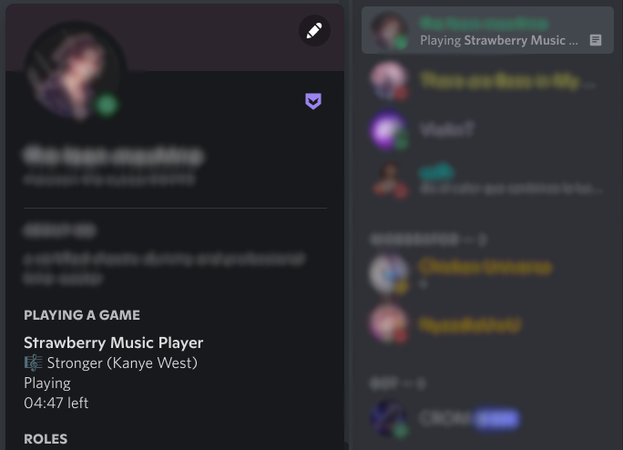

Strawberry / Discord Integration
================================

This is a simple Python script that displays whatever you're listening to in the
[Strawberry](https://www.strawberrymusicplayer.org/) as your "Now Playing" status in 
[Discord](https://discord.com/) on Linux Computers.



Disclaimer
------------

This has only been tested on Manjaro KDE with Python 3.10, Strawberry 1.0.5-2, and the standalone Discord client 0.0.18-1.

It requires the `pypresence` and `dbus-python` Python modules.  Technically, this could work with any distro that can install those two modules and run a Python script, but feel free to open an issue if you have any successes or failures on other platforms. 

Installation
-----

1. If you don't have them already, install the latest versions of `pypresence` and `dbus-python` either through the Terminal or through your GUI Package Manager.
2. Start Discord
3. Start Strawberry
4. In the Terminal, run `chmod +x strawberry_discord.py`
5. Double check `strawberry_discord.py` is an executable by running `ls -l strawberry_discord.py` (you should see something along the lines of `-rwxr-xr-x`)
6. Run `python strawberry_discord.py`

That's all there is to it.  It will quietly run in the background and update your status in Discord every 15 seconds.

If you want to customize the exact string it puts in the details, edit the `DETAILS_STRING` variable at the top of `strawberry_discord.py`.  You can substitute in any value that is returned in Strawberry's metadata, although note that any colons (`:`) in the keys must be replaced with dashes (`-`) for it to work.  You can run this command while Strawberry is playing to see a list of values:
```bash
qdbus org.mpris.MediaPlayer2.strawberry /org/mpris/MediaPlayer2 org.freedesktop.DBus.Properties.Get \org.mpris.MediaPlayer2.Player Metadata
```

Explanation
----------

The only key differnece between this fork and the original, is that the Python script will now look for the Strawberry Music Player, instead of Clementine, as both are identified through D-Bus MPRIS.

I also followed the instructions within [this](https://github.com/minneyar/clementine-discord/issues/4#issuecomment-819538510) issue, fixing the `xseam-artist` display option, along with making that the default secondary display item.